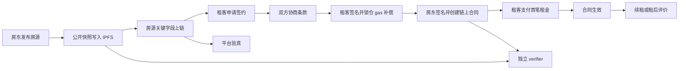
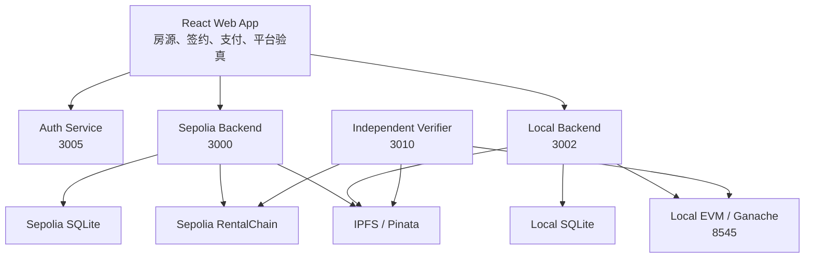

# CCL Housing

> 信源链：一个围绕房源、合同、支付与独立验真的区块链租房原型。

[](https://nodejs.org/)
[](https://react.dev/)
[](https://soliditylang.org/)
[](https://ethereum.org/)

CCL Housing 是一个采用混合架构的链上租房演示系统。平台负责账号、风控、检索和业务编排；智能合约负责锚定关键事实；IPFS 负责保存公开验真材料；独立 verifier 允许第三方在不登录平台的情况下验证本地合同 PDF、房源快照和评价材料。

项目重点不是把全部数据搬上链，而是让租房流程中的关键事实可以追溯、可以核验，也不再完全依赖平台单方面解释。

## 目录

- [项目亮点](#项目亮点)
- [业务流程](#业务流程)
- [系统架构](#系统架构)
- [技术栈](#技术栈)
- [快速开始](#快速开始)
- [独立验真工具](#独立验真工具)
- [环境变量](#环境变量)
- [常用命令](#常用命令)
- [项目结构](#项目结构)
- [安全与隐私边界](#安全与隐私边界)
- [项目文档](#项目文档)

## 项目亮点

### 完整租赁闭环

系统已经覆盖一条可运行的主流程：

1. 房东发布房源并锚定公开快照。
2. 租客浏览房源，提交签约申请。
3. 双方协商附加条款，任一方开始签署后冻结版本。
4. 租客签名并锁仓 gas 补偿预算。
5. 房东签名并创建链上合同记录。
6. 租客完成首笔支付，合同进入生效状态。
7. 合同结束后可提交租后评价，也可基于父合同发起续租。

### 可验证，而不是只展示“已上链”

后端不会仅凭前端提交的交易哈希推进状态。关键链上回写会核对：

- 交易 receipt 与目标合约
- 调用方法与参数
- `msg.value`
- 发送者地址
- 对应链上事件

房源、合同、支付、gas 锁仓、评价与反馈统一进入链上操作台账，状态为 `pending`、`confirmed` 或 `failed`。

### 独立 verifier

`verifier/` 是一个与平台账号系统解耦的验真工具。它可以：

- 上传本地合同 PDF，重算合同哈希并恢复签名地址
- 直接读取链上房源记录
- 校验 IPFS 房源快照、图片、反馈与租后评价
- 按时间点追溯历史房源版本
- 展示合同付款、生效、到期状态与中国时间时间线

### 双环境隔离

Sepolia 与 Local EVM 共用一套业务代码，但数据库、账号会话、部署文件与 API 入口彼此隔离。开发调试不会污染测试网演示数据。

### 混合架构边界清晰

本项目不是“完全去中心化租房平台”。更准确的定位是：

> 中心化交易与治理层 + 链上可验证真相层 + IPFS 验真材料层

这样可以兼顾租房业务中的隐私、查询体验、内容治理和链上可信度。

## 业务流程



## 系统架构



| 组件 | 职责 |
| --- | --- |
| `apps/frontend` | 页面交互、钱包连接、网络切换、链上交易触发、验真结果展示 |
| `apps/backend` | 账号、房源、合同、支付、通知、风控、permit 签发、链上回写校验 |
| `blockchain` | `RentalChain.sol` 合约、Hardhat 编译和部署脚本 |
| `verifier` | 不依赖平台账号系统的合同 PDF、链上和 IPFS 独立验真工具 |
| `scripts` | Windows 与 macOS 的启动、重置、部署、IPFS 和回归脚本 |

## 技术栈

| 层级 | 技术 |
| --- | --- |
| 前端 | React 18、Vite、Tailwind CSS、ethers.js、Leaflet |
| 后端 | Node.js、Express、sql.js、JWT、PDFKit |
| 智能合约 | Solidity 0.8.20、Hardhat、OpenZeppelin、Ganache |
| 内容存储 | 本地 Kubo IPFS 或 Pinata |
| 独立验真 | Node.js、Express、ethers.js、pdf-parse |

## 快速开始

### 前置要求

- Node.js 18+
- npm
- MetaMask 浏览器扩展
- macOS 或 Windows PowerShell

### 1. 安装依赖

```bash
npm --prefix apps/backend install
npm --prefix apps/frontend install
npm --prefix blockchain install
npm --prefix verifier install
```

### 2. 创建本地配置

```bash
cp apps/backend/.env.example apps/backend/.env
cp apps/frontend/.env.example apps/frontend/.env
```

本地链模式下，需要在 MetaMask 中添加网络：

| 字段 | 值 |
| --- | --- |
| 网络名称 | `Local EVM (31337)` |
| RPC URL | `http://127.0.0.1:8545` |
| Chain ID | `31337` |
| 货币符号 | `ETH` |

### 3. 启动本地链并部署合约

macOS：

```bash
bash scripts/mac/reset-local-and-redeploy.sh
```

Windows PowerShell：

```powershell
powershell -ExecutionPolicy Bypass -File scripts/ps1/reset-local-and-redeploy.ps1
```

该脚本会启动持久化 Ganache 节点、重新部署本地合约、同步 ABI，并回填前端的 Local 合约地址。

### 4. 启动本地业务服务

macOS：

```bash
bash scripts/mac/start-local-services.sh
```

Windows PowerShell：

```powershell
powershell -ExecutionPolicy Bypass -File scripts/ps1/start-local-services.ps1
```

启动后访问：

- Web App：`http://127.0.0.1:3001`
- Auth Service：`http://127.0.0.1:3005`
- Local Backend：`http://127.0.0.1:3002`
- Local EVM RPC：`http://127.0.0.1:8545`

### 5. 启动 IPFS

公开房源快照、图片、反馈与评价默认通过 IPFS 保存。首次启动本地 Kubo 节点：

macOS：

```bash
bash scripts/mac/setup-local-ipfs.sh
bash scripts/mac/start-local-ipfs.sh
```

Windows PowerShell：

```powershell
powershell -ExecutionPolicy Bypass -File scripts/ps1/setup-local-ipfs.ps1
powershell -ExecutionPolicy Bypass -File scripts/ps1/start-local-ipfs.ps1
```

默认端口：

| 服务 | 地址 |
| --- | --- |
| IPFS API | `http://127.0.0.1:5001/api/v0` |
| IPFS Gateway | `http://127.0.0.1:8080/ipfs/` |

也可以在系统设置页选择 Pinata，并填写 Pinata JWT。

## 独立验真工具

独立 verifier 不依赖平台登录状态。启动方式：

macOS：

```bash
bash scripts/mac/start-verifier.sh
```

Windows PowerShell：

```powershell
powershell -ExecutionPolicy Bypass -File scripts/ps1/start-verifier.ps1
```

访问 `http://127.0.0.1:3010` 后，可以：

1. 上传合同 PDF 完成本地强校验。
2. 输入房源 ID 校验最新公开快照。
3. 输入时间戳追溯历史版本。
4. 查看房源图片、反馈与真实租客评价。

更多说明见 [`verifier/README.md`](verifier/README.md)。

## 环境变量

### 后端

复制 [`apps/backend/.env.example`](apps/backend/.env.example)：

```env
JWT_SECRET=change_me_to_a_long_random_string
PORT=3000
HOST=127.0.0.1
AUTH_PORT=3005
CHAIN_ENV=sepolia
JSON_BODY_LIMIT=100mb

# Optional
# SEPOLIA_RPC_URL=https://ethereum-sepolia.publicnode.com
# LOCAL_RPC_URL=http://127.0.0.1:8545
# IPFS_ENABLED=1
# IPFS_API_URL=http://127.0.0.1:5001/api/v0
# IPFS_GATEWAY_URL=http://127.0.0.1:8080/ipfs
```

### 前端

复制 [`apps/frontend/.env.example`](apps/frontend/.env.example)：

```env
VITE_DEFAULT_NETWORK=sepolia
VITE_API_BASE_AUTH=/api-auth
VITE_API_BASE_SEPOLIA=/api
VITE_API_BASE_LOCAL=/api-local
VITE_CONTRACT_ADDRESS_SEPOLIA=0xYourSepoliaContractAddress
VITE_CONTRACT_ADDRESS_LOCAL=0xYourLocalContractAddress
```

### Sepolia 部署

复制 [`blockchain/.env.example`](blockchain/.env.example)：

```env
SEPOLIA_RPC_URL=https://ethereum-sepolia.publicnode.com
PRIVATE_KEY=0xyour_private_key_without_spaces
```

不要把真实私钥、JWT、数据库或运行时配置提交到 Git。

## 常用命令

### 根目录 npm 命令

| 命令 | 说明 |
| --- | --- |
| `npm run dev:backend` | 启动单个后端开发进程 |
| `npm run dev:frontend` | 启动前端开发服务器 |
| `npm run build:frontend` | 构建前端 |
| `npm run sync:abi` | 同步合约 ABI 与部署地址 |
| `npm run check:abi` | 检查 ABI 与部署地址是否一致 |
| `npm run test:env-isolation` | 检查 Sepolia 与 Local 环境隔离 |

### 服务脚本

| 场景 | macOS | Windows PowerShell |
| --- | --- | --- |
| 启动 Sepolia 服务 | `bash scripts/mac/start-sepolia-services.sh` | `scripts/ps1/start-sepolia-services.ps1` |
| 启动 Local 服务 | `bash scripts/mac/start-local-services.sh` | `scripts/ps1/start-local-services.ps1` |
| 并行启动双环境 | `bash scripts/mac/start-parallel-services.sh` | `scripts/ps1/start-parallel-services.ps1` |
| 启动本地链 | `bash scripts/mac/start-persistent-local-node.sh` | `scripts/ps1/start-persistent-local-node.ps1` |
| 重置 Local 并重新部署 | `bash scripts/mac/reset-local-and-redeploy.sh` | `scripts/ps1/reset-local-and-redeploy.ps1` |
| 启动独立 verifier | `bash scripts/mac/start-verifier.sh` | `scripts/ps1/start-verifier.ps1` |

Windows 脚本请使用：

```powershell
powershell -ExecutionPolicy Bypass -File <script-path>
```

## 项目结构

```text
.
├── apps
│   ├── backend              # Express API、认证服务、SQLite 数据与链上回写校验
│   └── frontend             # React Web App
├── blockchain               # Solidity 合约、Hardhat 配置与部署脚本
├── docs                     # 架构、部署、接口、日志与专题文档
├── scripts
│   ├── mac                  # macOS shell 脚本
│   └── ps1                  # Windows PowerShell 脚本
└── verifier                 # 独立验真 Web App 与 CLI
```

## 安全与隐私边界

- 合同正文与合同 PDF 不上传 IPFS。独立合同验真依赖用户本地保存的 PDF。
- IPFS 只保存公开验真材料：房源图片、公开快照、反馈和租后评价。
- Sepolia 与 Local 的数据库、账号库、会话和部署文件彼此隔离。
- 本地 Ganache 测试私钥只能用于 `chainId=31337` 的开发环境，不可用于真实资产。
- 当前系统设置接口面向本地演示环境，未设计为公网管理后台。部署到公网前必须补充管理员鉴权、密钥托管和访问控制。

## 项目文档

| 文档 | 内容 |
| --- | --- |
| [`docs/已实现总览.md`](docs/已实现总览.md) | 当前已完成能力清单 |
| [`docs/项目定位与架构说明.md`](docs/项目定位与架构说明.md) | 混合架构定位与边界 |
| [`docs/配置与部署教程.md`](docs/配置与部署教程.md) | 完整部署、MetaMask、IPFS 和 verifier 教程 |
| [`docs/启动脚本说明.md`](docs/启动脚本说明.md) | Windows 与 macOS 脚本索引 |
| [`docs/后端接口与前端调用文档.md`](docs/后端接口与前端调用文档.md) | API 与前端调用关系 |
| [`docs/身份绑定与第三方实名签署说明.md`](docs/身份绑定与第三方实名签署说明.md) | 钱包绑定和签署说明 |
| [`docs/日志埋点说明.md`](docs/日志埋点说明.md) | 日志与链上操作台账 |
| [`docs/todo-sync/剩余事项待办.md`](docs/todo-sync/剩余事项待办.md) | 后续增强方向 |

## 项目状态

CCL Housing 当前定位为课程设计、技术验证和演示用途的原型项目。它已经形成完整主链路，但尚未完成面向生产环境的安全审计、密钥托管、管理员权限收口和高可用部署。
