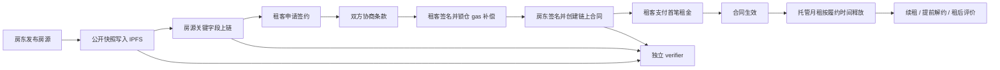
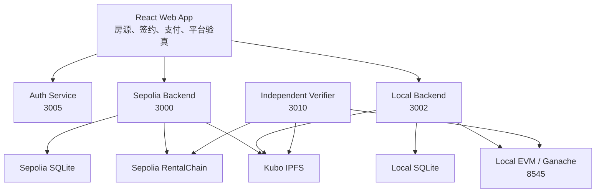

# 链上安居

<p align="center"><sub>Onchain Housing：围绕房源、合同、支付、托管释放与独立验真的链上租赁可信交易系统。</sub></p>

<p align="center">
  <a href="docs/assets/onchain-housing-banner.html">
    
  </a>
</p>

链上安居把租房流程中的关键事实锚定到 EVM 链上，并通过 IPFS 保存公开验真材料。平台负责业务编排，智能合约负责关键状态与资金规则，独立验真工具负责在不登录平台账号的情况下核查合同 PDF、房源记录、房源详情和托管月租释放状态。

<p align="center">
  <a href="LICENSE"></a>
  <a href="#系统架构"></a>
  <a href="#独立验真工具"></a>
  <a href="#快速开始"></a>
</p>

<p align="center">
  <a href="#技术栈"></a>
  <a href="#技术栈"></a>
  <a href="#技术栈"></a>
  <a href="#系统架构"></a>
  <a href="#环境变量"></a>
</p>

<p align="center">
  <a href="docs/assets/onchain-housing-banner.html">欢迎页 HTML 源码</a> · <a href="#界面预览">界面预览</a> · <a href="#快速开始">快速开始</a> · <a href="#项目文档">项目文档</a>
</p>

---

## 界面预览

<table>
  <tr>
    <td colspan="2"></td>
  </tr>
  <tr>
    <td></td>
    <td></td>
  </tr>
</table>

---

## 核心能力

| 能力 | 说明 |
|---|---|
| 房源发布与公开快照 | 房源图片和公开快照写入 IPFS，房源关键字段和快照哈希写入链上。 |
| 合同签署与 PDF 验真 | 双方使用钱包签署合同消息，合同 PDF 内含链上智能合约配置、合同哈希、签名消息与签名值。 |
| 链上支付与托管 | 首笔租金进入合约，平台手续费为 10 bps，履约保证金为房东净额的 10%，剩余托管金额按履约时间释放。 |
| 提前解约 | 仅租客可发起提前解约，房东获得已履约部分托管金额，租客取回未履约托管金额，履约保证金不退。 |
| 续租管理 | 支持父子合同关系，父合同提前解约时自动取消尚未生效的续约子合同。 |
| 租后评价与房源反馈 | 评价与反馈正文保存到 IPFS，链上保存哈希、CID 和评分锚点。 |
| 独立验真 | 不依赖平台账号系统，可核查合同 PDF、房源链上记录、房源详情和托管释放状态。 |
| 双环境运行 | Sepolia 与 Local 使用独立后端端口、数据库、会话、合约部署文件和前端 API 入口。 |

后端不信任前端单方面提交的交易哈希。链上回写会核对交易 receipt、调用方法、`msg.value`、发送者地址和对应事件，全部通过后才推进平台业务状态。

---

## 可验证内容

| 核查对象 | 验真方式 |
|---|---|
| 合同 PDF | 上传本地 PDF，重算合同内容哈希，并恢复双方签名地址。 |
| 合同链上状态 | 根据合同 ID 查询链上合同记录、付款状态、生效状态、释放状态和时间线。 |
| 房源链上记录 | 根据房源 ID 查询链上房源记录，并比对 IPFS 快照。 |
| 房源详情 | 查看房源公开快照、图片、反馈、评价和链上锚点。 |
| 应急托管释放 | 房东选择已保存的合约配置，手填合同 ID，查询可释放状态，并用房东钱包触发释放。 |

合同正文和合同 PDF 不上传 IPFS。独立合同验真依赖用户本地保存的 PDF；IPFS 仅保存公开验真材料。

---

## 快速开始

### 1. 安装依赖

```bash
git clone https://github.com/<your-handle>/house-rent.git
cd house-rent

npm --prefix apps/backend install
npm --prefix apps/frontend install
npm --prefix blockchain install
npm --prefix verifier install
```

### 2. 创建配置文件

```bash
cp apps/backend/.env.example apps/backend/.env
cp apps/frontend/.env.example apps/frontend/.env
cp blockchain/.env.example blockchain/.env
```

Windows PowerShell 可使用：

```powershell
Copy-Item apps/backend/.env.example apps/backend/.env
Copy-Item apps/frontend/.env.example apps/frontend/.env
Copy-Item blockchain/.env.example blockchain/.env
```

### 3. 启动本地链并部署合约

macOS：

```bash
bash scripts/mac/reset-local-and-redeploy.sh
```

Windows PowerShell：

```powershell
powershell -ExecutionPolicy Bypass -File scripts/ps1/reset-local-and-redeploy.ps1
```

### 4. 启动本地服务

macOS：

```bash
bash scripts/mac/start-local-services.sh
```

Windows PowerShell：

```powershell
powershell -ExecutionPolicy Bypass -File scripts/ps1/start-local-services.ps1
```

启动后访问 `http://127.0.0.1:3001`。MetaMask 本地网络配置如下：

| 字段 | 值 |
|---|---|
| 网络名称 | `Local EVM (31337)` |
| RPC URL | `http://127.0.0.1:8545` |
| Chain ID | `31337` |
| 货币符号 | `ETH` |

完整部署说明见 [docs/配置与部署教程.md](docs/配置与部署教程.md)。

---

## 业务流程



---

## 系统架构



| 组件 | 职责 |
|---|---|
| `apps/frontend` | 页面交互、钱包连接、网络切换、链上交易触发、验真结果展示。 |
| `apps/backend` | 账号、房源、合同、支付、通知、permit 签发、链上回写校验和数据库编排。 |
| `blockchain` | `RentalChain.sol` 合约、Hardhat 编译、Ganache 本地链和部署脚本。 |
| `verifier` | 不依赖平台账号系统的合同 PDF、链上记录、IPFS 材料和应急释放验真工具。 |
| `scripts` | Windows 与 macOS 的启动、重置、部署、IPFS 和回归脚本。 |
| `docs` | 架构、部署、接口、日志、错误码和链上业务规则文档。 |

---

## 技术栈

| 层级 | 技术 |
|---|---|
| 前端 | React 18、Vite、Tailwind CSS、ethers.js、Leaflet |
| 后端 | Node.js、Express、sql.js、JWT、PDFKit |
| 智能合约 | Solidity 0.8.20、Hardhat、OpenZeppelin Contracts、Ganache |
| 内容存储 | Kubo IPFS |
| 独立验真 | Node.js、Express、ethers.js、pdf-parse |

---

## 独立验真工具

独立 verifier 访问地址为 `http://127.0.0.1:3010`。

macOS：

```bash
bash scripts/mac/start-verifier.sh
```

Windows PowerShell：

```powershell
powershell -ExecutionPolicy Bypass -File scripts/ps1/start-verifier.ps1
```

独立 verifier 提供以下页面：

| 页面 | 功能 |
|---|---|
| 合约配置 | 保存、编辑、导入链上智能合约配置。配置名称不能重复，重名时按替换处理。 |
| 合同 PDF 验真 | 上传 PDF，读取内嵌链上智能合约配置、合同哈希、签名消息与签名值，并重算校验。 |
| 房源验真 | 根据房源 ID 校验链上房源记录与 IPFS 公开快照。 |
| 房源详情 | 展示房源公开信息、图片、反馈、评价和链上锚点。 |
| 应急操作 | 选择已保存的合约配置，手填合同 ID，查询托管释放状态，并用房东钱包触发释放。 |

更多说明见 [verifier/README.md](verifier/README.md)。

---

## 环境变量

### 后端：`apps/backend/.env`

```env
JWT_SECRET=change_me_to_a_long_random_string
PORT=3000
HOST=127.0.0.1
AUTH_PORT=3005
CHAIN_ENV=sepolia
JSON_BODY_LIMIT=100mb
PAYMENT_WINDOW_HOURS=2

# AI 智能搜索（DeepSeek API）
# 填入后，/listings 智能搜索将调用 DeepSeek 解析自然语言，否则降级为本地正则解析
# 申请地址：https://platform.deepseek.com
# DEEPSEEK_API_KEY=sk-xxxxxxxxxxxxxxxx

# RPC
# SEPOLIA_RPC_URL=https://ethereum-sepolia.publicnode.com
# LOCAL_RPC_URL=http://127.0.0.1:8545

# IPFS
# IPFS_ENABLED=1
# IPFS_API_URL=http://127.0.0.1:5001/api/v0
# IPFS_GATEWAY_URL=http://127.0.0.1:8080/ipfs
```

启动脚本会为进程注入对应的 `CHAIN_ENV`，不要在并行双环境运行时手动混用环境。

### 前端：`apps/frontend/.env`

```env
VITE_DEFAULT_NETWORK=sepolia
VITE_API_BASE_AUTH=/api-auth
VITE_API_BASE_SEPOLIA=/api
VITE_API_BASE_LOCAL=/api-local
VITE_CONTRACT_ADDRESS_SEPOLIA=0xYourSepoliaContractAddress
VITE_CONTRACT_ADDRESS_LOCAL=0xYourLocalContractAddress
```

### 合约部署：`blockchain/.env`

```env
SEPOLIA_RPC_URL=https://ethereum-sepolia.publicnode.com
PRIVATE_KEY=0xyour_deployer_private_key_without_spaces
PAYMENT_WINDOW_HOURS=2
TRUSTED_SIGNER_ADDRESS=0xTrustedSignerAddress
PLATFORM_FEE_RECIPIENT_ADDRESS=0xPlatformFeeRecipientAddress
```

| 变量 | 说明 |
|---|---|
| `PRIVATE_KEY` | 合约部署账户私钥。 |
| `TRUSTED_SIGNER_ADDRESS` | 平台 permit 签名地址。未配置时使用部署账户地址。 |
| `PLATFORM_FEE_RECIPIENT_ADDRESS` | 平台手续费接收地址。未配置时使用签名地址。 |
| `PAYMENT_WINDOW_HOURS` | 首笔支付窗口小时数，部署时写入合约构造参数。 |

不要把真实私钥、JWT、数据库文件或运行时配置提交到 Git。

---

## 常用命令

### 根目录 npm

| 命令 | 说明 |
|---|---|
| `npm run dev:backend` | 启动单个后端开发进程。 |
| `npm run dev:frontend` | 启动前端开发服务器。 |
| `npm run build:frontend` | 构建前端。 |
| `npm run sync:abi` | 同步合约 ABI 与部署地址。 |
| `npm run check:abi` | 检查 ABI 与部署地址是否一致。 |
| `npm run test:env-isolation` | 检查 Sepolia 与 Local 环境隔离。 |
| `node scripts/seed-local-listings.js` | 向 Local 数据库写入演示用户和北京房源数据。 |

### 服务脚本

| 场景 | macOS | Windows PowerShell |
|---|---|---|
| 启动 Sepolia 服务 | `bash scripts/mac/start-sepolia-services.sh` | `scripts/ps1/start-sepolia-services.ps1` |
| 启动 Local 服务 | `bash scripts/mac/start-local-services.sh` | `scripts/ps1/start-local-services.ps1` |
| 并行启动双环境 | `bash scripts/mac/start-parallel-services.sh` | `scripts/ps1/start-parallel-services.ps1` |
| 启动本地链 | `bash scripts/mac/start-persistent-local-node.sh` | `scripts/ps1/start-persistent-local-node.ps1` |
| 重置 Local 并重新部署 | `bash scripts/mac/reset-local-and-redeploy.sh` | `scripts/ps1/reset-local-and-redeploy.ps1` |
| 启动本地 IPFS | `bash scripts/mac/start-local-ipfs.sh` | `scripts/ps1/start-local-ipfs.ps1` |
| 启动独立 verifier | `bash scripts/mac/start-verifier.sh` | `scripts/ps1/start-verifier.ps1` |
| macOS 一键演示环境 | `bash scripts/mac/start-demo.sh` | - |

Windows 脚本统一使用：

```powershell
powershell -ExecutionPolicy Bypass -File <script-path>
```

---

## 资金与状态规则

| 规则 | 说明 |
|---|---|
| 平台手续费 | 10 bps，从首笔支付总额中扣除。 |
| 履约保证金 | 房东净额的 10%，支付后直接归房东，提前解约时不退。 |
| 托管月租 | 房东净额扣除履约保证金后的部分进入合约托管。 |
| 月租释放 | 合约根据已履约时间计算可释放金额，平台服务账户可自动触发 `releaseDueRent(contractId)`；故障时房东可在独立 verifier 应急触发。 |
| 提前解约 | 租客触发 `terminateContractEarly(contractId)`，房东获得已履约托管金额，租客取回未履约托管金额。 |
| 子合同处理 | 父合同提前解约时，尚未生效的续约子合同自动取消。 |

平台数据库中的合同状态包括：

| 状态 | 含义 |
|---|---|
| `pending` | 合同已创建，等待签署。 |
| `tenant_signed` | 租客已签署，等待房东签署。 |
| `pending_payment` | 双方已签署，等待首笔支付。 |
| `active` | 已付款并处于生效期。 |
| `ended` | 合同自然到期。 |
| `cancelled_before_payment` | 未上链付款前取消或支付窗口过期。 |
| `expired` | 签署流程超时。 |
| `terminated_early` | 租客提前解约。 |

---

## 安全与隐私边界

- 合同正文与合同 PDF 不上传 IPFS。独立合同验真依赖用户本地保存的 PDF。
- IPFS 只保存公开验真材料：房源图片、公开快照、反馈正文和租后评价正文。
- Sepolia 与 Local 的数据库、账号库、会话和部署文件彼此隔离。
- 本地 Ganache 默认账户只用于 `chainId=31337` 的开发环境，不可用于真实资产。
- 前端不接收用户私钥。涉及签名和交易的操作由钱包完成。
- 私钥、JWT、数据库文件、合约运行时配置和 verifier 运行时配置不应提交到 Git。

---

## 当前实现范围

| 模块 | 状态 |
|---|---|
| 房源发布、编辑、公开快照与上链 | 已实现 |
| 合同协商、双方签署、PDF 导出与 PDF 验真 | 已实现 |
| 链上支付、手续费、履约保证金和托管月租 | 已实现 |
| 托管月租释放与独立 verifier 应急释放 | 已实现 |
| 租客提前解约与按履约时间结算 | 已实现 |
| 父子续约合同与提前解约联动取消 | 已实现 |
| 租后评价、房源反馈和 IPFS 材料校验 | 已实现 |
| Sepolia 与 Local 双环境运行 | 已实现 |
| 链上操作台账与通知 | 已实现 |
| 独立 verifier 合约配置管理、PDF 验真、房源验真、房源详情和应急操作 | 已实现 |
| 服务端房源筛选、智能搜索解析引擎标识和 Local 演示数据注入 | 已实现 |
| AI 智能搜索 sortBy 支持（价格、面积、最新）与客户端即时排序 | 已实现 |

---

## 项目结构

| 路径 | 职责 |
|---|---|
| [`apps/backend/`](apps/backend/) | Express API、认证服务、SQLite 数据与链上回写校验。 |
| [`apps/frontend/`](apps/frontend/) | React Web App、页面交互、钱包连接与平台验真。 |
| [`blockchain/`](blockchain/) | Solidity 合约、Hardhat 配置、Ganache 本地链与部署脚本。 |
| [`verifier/`](verifier/) | 独立验真 Web App。 |
| [`scripts/mac/`](scripts/mac/) | macOS shell 启动、重置、部署和 IPFS 脚本。 |
| [`scripts/ps1/`](scripts/ps1/) | Windows PowerShell 启动、重置、部署和 IPFS 脚本。 |
| [`scripts/seed-local-listings.js`](scripts/seed-local-listings.js) | Local 演示用户和房源数据写入脚本。 |
| [`docs/`](docs/) | 架构、部署、接口、日志、错误码和链上业务规则文档。 |

---

## 项目文档

| 文档 | 内容 |
|---|---|
| [`docs/已实现总览.md`](docs/已实现总览.md) | 当前能力清单与模块说明。 |
| [`docs/项目定位与架构说明.md`](docs/项目定位与架构说明.md) | 系统定位、分层架构和数据边界。 |
| [`docs/链上业务规则说明.md`](docs/链上业务规则说明.md) | 房源、合同、支付、托管、提前解约、续租和验真规则。 |
| [`docs/配置与部署教程.md`](docs/配置与部署教程.md) | 环境变量、部署、MetaMask、IPFS 和 verifier 配置。 |
| [`docs/启动脚本说明.md`](docs/启动脚本说明.md) | Windows 与 macOS 脚本索引。 |
| [`docs/后端接口与前端调用文档.md`](docs/后端接口与前端调用文档.md) | API 与前端调用关系。 |
| [`docs/错误码清单.md`](docs/错误码清单.md) | 后端错误码、触发条件和处理建议。 |
| [`docs/日志埋点说明.md`](docs/日志埋点说明.md) | 日志分类、链上操作台账和排查方法。 |
| [`docs/项目结构与文件职责说明.md`](docs/项目结构与文件职责说明.md) | 目录结构与关键文件职责。 |
| [`verifier/README.md`](verifier/README.md) | 独立验真工具使用说明。 |

---

## 参考技术

| 技术 | 角色 |
|---|---|
| [Hardhat](https://hardhat.org/) | Solidity 编译、部署与测试框架。 |
| [OpenZeppelin Contracts](https://openzeppelin.com/contracts/) | ECDSA 签名校验与重入防护。 |
| [ethers.js](https://ethers.org/) | 前端、后端和 verifier 的链上交互。 |
| [Ganache](https://trufflesuite.com/ganache/) | 本地 EVM 节点。 |
| [IPFS Kubo](https://github.com/ipfs/kubo) | 公开验真材料存储。 |
| [sql.js](https://sql.js.org/) | WebAssembly SQLite 数据库。 |
| [PDFKit](https://pdfkit.org/) | 合同 PDF 生成。 |

---

## License

MIT - 见 [LICENSE](LICENSE)。
