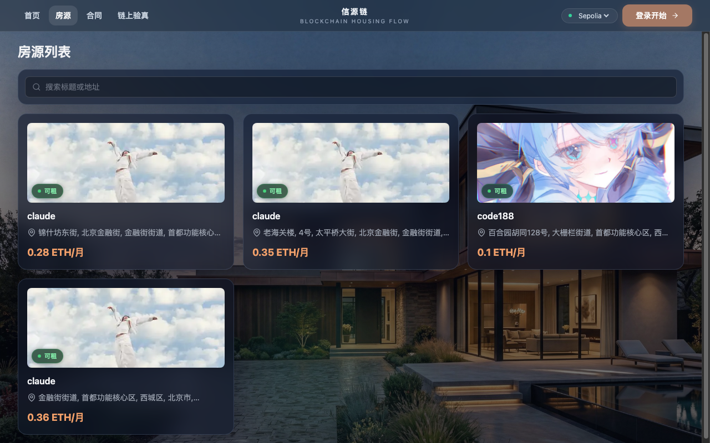
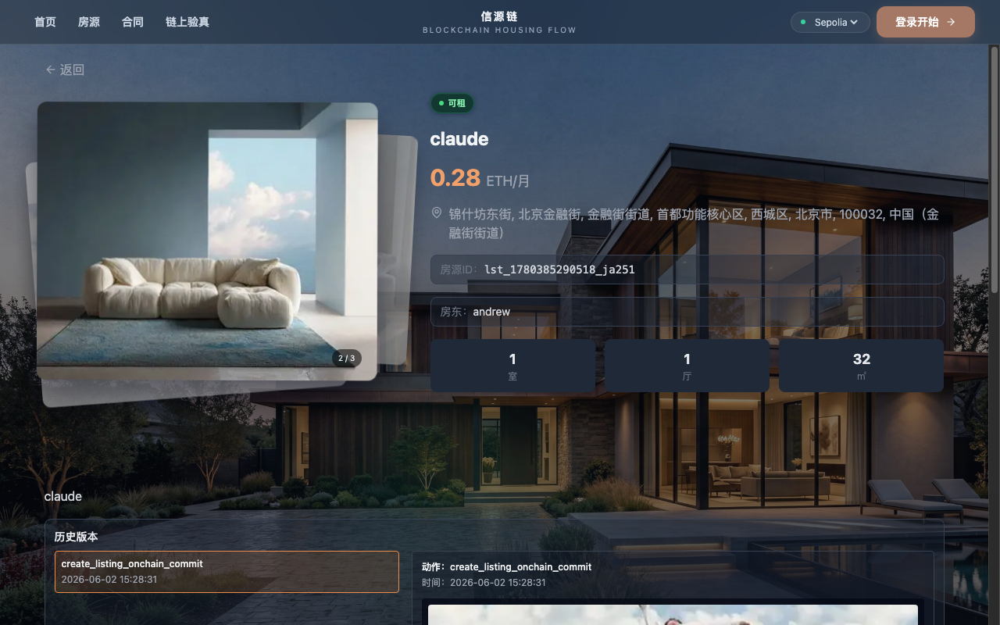
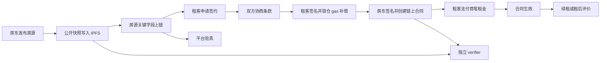
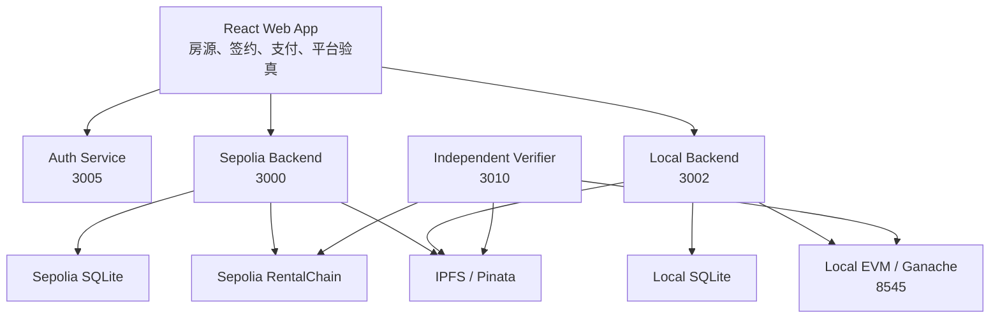

# 链上安居

<p align="center"><sub>链上安居：一个围绕房源、合同、支付与独立验真的区块链租房原型——<b>中心化交易层 + 链上可验证真相层 + IPFS 验真材料层</b>。</sub></p>

<p align="center">
  <a href="docs/assets/onchain-housing-banner.html">
    
  </a>
</p>

> **链上可信度不是噱头，是可查证的事实。** 链上安居 把租房流程中的关键事实——合同哈希、支付记录、房源快照——锚定到 Sepolia 或本地 EVM，任何人可以在不登录平台的情况下独立验证。**7 步完整租赁闭环** · **链上回写严格核查** · **独立 verifier** · **双环境隔离（Sepolia / Local）**

<p align="center">
  <a href="LICENSE"></a>
  <a href="#系统架构"></a>
  <a href="#独立验真工具"></a>
  <a href="#快速开始"></a>
  <a href="#项目状态"></a>
</p>

<p align="center">
  <a href="#技术栈"></a>
  <a href="#技术栈"></a>
  <a href="#技术栈"></a>
  <a href="#系统架构"></a>
  <a href="#环境变量"></a>
</p>

<p align="center">
  <a href="docs/assets/onchain-housing-banner.html">🎨 欢迎页 HTML 源码</a> · <a href="#界面预览">📸 界面截图</a> · <a href="#快速开始">⚡ 快速开始</a>
</p>

---

## 界面预览

<table>
  <tr>
    <td colspan="2"></td>
  </tr>
  <tr>
    <td></td>
    <td></td>
  </tr>
</table>

---

## 可验证到什么程度

每笔关键操作都在链上留下痕迹，并可通过独立 verifier 核查，无需平台账号：

| 核查对象 | 验真方式 |
|---|---|
| **合同 PDF** | 上传本地文件，重算哈希并恢复双方签名地址 |
| **房源快照** | 输入房源 ID，校验最新公开 IPFS 快照 |
| **历史版本** | 输入时间戳，追溯任意时点的房源状态 |
| **支付与生效** | 查询链上合同，展示付款、生效、到期时间线（中国时区） |
| **图片与评价** | 比对 IPFS 上的房源图片、反馈与真实租客评价 |

后端不信任前端单方面提交的交易哈希。链上回写会核对 receipt、调用方法、`msg.value`、发送者地址和对应事件，全部通过才推进合同状态。

---

## Why this exists

| 传统租房平台 | 链上安居 |
|---|---|
| 合同由平台保存，出纠纷只能信平台 | 合同哈希写入链上，本地 PDF 可独立核验签名 |
| 支付记录平台说了算 | 链上支付事件可追溯，时间线公开 |
| 房源信息可随时被修改 | 公开快照写入 IPFS，历史版本按时间点追溯 |
| 租后评价可被平台删除 | 评价锚定链上，verifier 可独立查阅 |
| 验真需要登录平台账号 | 独立 verifier 无需账号，任意第三方可用 |

项目重点不是把全部数据搬上链，而是让租房流程中的**关键事实**可以追溯、可以核验，也不再完全依赖平台单方面解释。

---

## At a glance

| | 你能做到什么 |
|---|---|
| **7 步租赁闭环** | 发布 → 申请 → 协商 → 签名 + gas 锁仓 → 支付 → 生效 → 评价 / 续租 |
| **链上回写核查** | 后端验证 receipt、方法、`msg.value`、事件；所有操作进台账（pending / confirmed / failed） |
| **独立 verifier** | 无需登录；上传 PDF 本地验签；链上合同、IPFS 快照均可查 |
| **双环境隔离** | Sepolia 与 Local 数据库、账号会话、ABI、API 入口彼此独立 |
| **IPFS 公开材料** | 房源快照、图片、反馈、评价写入 IPFS；合同正文不上传 |
| **许可证** | MIT（课程设计 / 技术验证 / 演示用途） |

---

## 快速开始

```bash
git clone https://github.com/<your-handle>/house-rent.git
cd house-rent

# 安装依赖
npm --prefix apps/backend install
npm --prefix apps/frontend install
npm --prefix blockchain install
npm --prefix verifier install

# 创建本地配置
cp apps/backend/.env.example apps/backend/.env
cp apps/frontend/.env.example apps/frontend/.env

# 启动本地链并部署合约（macOS）
bash scripts/mac/reset-local-and-redeploy.sh

# 启动本地服务
bash scripts/mac/start-local-services.sh
```

**五分钟到第一个可用界面。** 完成后访问 `http://127.0.0.1:3001`，连接 MetaMask（本地链 chainId 31337），即可走完完整租赁流程。

完整配置说明见 [docs/配置与部署教程.md](docs/配置与部署教程.md)。

---

## 前置要求

- Node.js 18+
- npm
- MetaMask 浏览器扩展
- macOS 或 Windows PowerShell

MetaMask 本地网络配置：

| 字段 | 值 |
|---|---|
| 网络名称 | `Local EVM (31337)` |
| RPC URL | `http://127.0.0.1:8545` |
| Chain ID | `31337` |
| 货币符号 | `ETH` |

---

## 业务流程



---

## 系统架构



| 组件 | 职责 |
|---|---|
| `apps/frontend` | 页面交互、钱包连接、网络切换、链上交易触发、验真结果展示 |
| `apps/backend` | 账号、房源、合同、支付、通知、风控、permit 签发、链上回写校验 |
| `blockchain` | `RentalChain.sol` 合约、Hardhat 编译和部署脚本 |
| `verifier` | 不依赖平台账号系统的合同 PDF、链上和 IPFS 独立验真工具 |
| `scripts` | Windows 与 macOS 的启动、重置、部署、IPFS 和回归脚本 |

---

## 技术栈

| 层级 | 技术 |
|---|---|
| 前端 | React 18、Vite、Tailwind CSS、ethers.js、Leaflet |
| 后端 | Node.js、Express、sql.js、JWT、PDFKit |
| 智能合约 | Solidity 0.8.20、Hardhat、OpenZeppelin、Ganache |
| 内容存储 | 本地 Kubo IPFS 或 Pinata |
| 独立验真 | Node.js、Express、ethers.js、pdf-parse |

---

## 独立验真工具

独立 verifier 不依赖平台登录状态，访问 `http://127.0.0.1:3010`：

```bash
# macOS
bash scripts/mac/start-verifier.sh

# Windows PowerShell
powershell -ExecutionPolicy Bypass -File scripts/ps1/start-verifier.ps1
```

启动后可以：

1. 上传合同 PDF，重算哈希并恢复签名地址（本地强校验）。
2. 输入房源 ID，校验最新公开 IPFS 快照。
3. 输入时间戳，追溯历史房源版本。
4. 查看房源图片、反馈与真实租客评价。

更多说明见 [verifier/README.md](verifier/README.md)。

---

## 环境变量

### 后端（`apps/backend/.env`）

```env
JWT_SECRET=change_me_to_a_long_random_string   # 必填，不可使用默认值，服务启动时强制校验
PORT=3000
HOST=127.0.0.1
AUTH_PORT=3005
CHAIN_ENV=sepolia
JSON_BODY_LIMIT=100mb
DEMO_LOGIN_ENABLED=false   # 本地演示时设为 true，生产环境保持 false

# Optional
# SEPOLIA_RPC_URL=https://ethereum-sepolia.publicnode.com
# LOCAL_RPC_URL=http://127.0.0.1:8545
# IPFS_ENABLED=1
# IPFS_API_URL=http://127.0.0.1:5001/api/v0
# IPFS_GATEWAY_URL=http://127.0.0.1:8080/ipfs
```

### 前端（`apps/frontend/.env`）

```env
VITE_DEFAULT_NETWORK=sepolia
VITE_API_BASE_AUTH=/api-auth
VITE_API_BASE_SEPOLIA=/api
VITE_API_BASE_LOCAL=/api-local
VITE_CONTRACT_ADDRESS_SEPOLIA=0xYourSepoliaContractAddress
VITE_CONTRACT_ADDRESS_LOCAL=0xYourLocalContractAddress
```

### Sepolia 部署（`blockchain/.env`）

```env
SEPOLIA_RPC_URL=https://ethereum-sepolia.publicnode.com
PRIVATE_KEY=0xyour_private_key_without_spaces
```

不要把真实私钥、JWT、数据库或运行时配置提交到 Git。

---

## 常用命令

### 根目录 npm

| 命令 | 说明 |
|---|---|
| `npm run dev:backend` | 启动单个后端开发进程 |
| `npm run dev:frontend` | 启动前端开发服务器 |
| `npm run build:frontend` | 构建前端 |
| `npm run sync:abi` | 同步合约 ABI 与部署地址 |
| `npm run check:abi` | 检查 ABI 与部署地址是否一致 |
| `npm run test:env-isolation` | 检查 Sepolia 与 Local 环境隔离 |

### 服务脚本

| 场景 | macOS | Windows PowerShell |
|---|---|---|
| 启动 Sepolia 服务 | `bash scripts/mac/start-sepolia-services.sh` | `scripts/ps1/start-sepolia-services.ps1` |
| 启动 Local 服务 | `bash scripts/mac/start-local-services.sh` | `scripts/ps1/start-local-services.ps1` |
| 并行启动双环境 | `bash scripts/mac/start-parallel-services.sh` | `scripts/ps1/start-parallel-services.ps1` |
| 启动本地链 | `bash scripts/mac/start-persistent-local-node.sh` | `scripts/ps1/start-persistent-local-node.ps1` |
| 重置 Local 并重新部署 | `bash scripts/mac/reset-local-and-redeploy.sh` | `scripts/ps1/reset-local-and-redeploy.ps1` |
| 启动独立 verifier | `bash scripts/mac/start-verifier.sh` | `scripts/ps1/start-verifier.ps1` |

Windows 脚本统一用：

```powershell
powershell -ExecutionPolicy Bypass -File <script-path>
```

---

## 安全与隐私边界

- 合同正文与合同 PDF 不上传 IPFS。独立合同验真依赖用户本地保存的 PDF。
- IPFS 只保存公开验真材料：房源图片、公开快照、反馈和租后评价。
- Sepolia 与 Local 的数据库、账号库、会话和部署文件彼此隔离。
- 本地 Ganache 测试私钥只能用于 `chainId=31337` 的开发环境，不可用于真实资产。
- 当前系统设置接口面向本地演示环境，未设计为公网管理后台。部署到公网前必须补充管理员鉴权、密钥托管和访问控制。

---

## 项目状态

主流程已稳定端到端运行（本地链和 Sepolia 均已验证）。当前定位为课程设计 / 技术验证 / 演示原型，尚未完成面向生产环境的安全审计和高可用部署。

| 模块 | 状态 |
|---|---|
| 7 步租赁闭环主流程 | ✅ 稳定 |
| 链上回写严格核查（receipt / 事件 / msg.value） | ✅ 稳定 |
| 独立 verifier（PDF / 链上 / IPFS） | ✅ 稳定 |
| 双环境隔离（Sepolia / Local） | ✅ 稳定 |
| IPFS 验真材料存储 | ✅ 稳定 |
| 链上操作台账（pending / confirmed / failed） | ✅ 稳定 |
| 合同到期自动通知 | ⏳ 计划中 |
| 多签支持（联名房东） | ⏳ 计划中 |
| 管理员权限收口与生产安全审计 | ⏳ 计划中 |
| 公网高可用部署 | ⏳ 计划中 |

---

## Roadmap

- [ ] 合同到期自动提醒（Email / Telegram）
- [ ] 多签支持（联名房东 / 联名租客）
- [ ] Web 版验真预览——浏览器内查看今日房源快照与合同状态
- [ ] 管理员权限收口与生产环境安全审计
- [ ] 公网部署文档（Docker / Nginx / HTTPS）

---

## Contributing

Issues、PR、新特性和 Bug 修复均欢迎。高价值贡献方向：

- **扩展链上验证逻辑** — 在 `apps/backend/` 补充更多链上事件校验场景。
- **改进独立 verifier** — 在 `verifier/` 增加新的校验维度或 UI 优化。
- **合约安全加固** — 审查 `blockchain/contracts/RentalChain.sol` 并提交发现。
- **补充文档** — 更新 `docs/` 目录，尤其是 API 文档和部署教程。
- **新增平台脚本** — 在 `scripts/mac/` 或 `scripts/ps1/` 补充缺失的自动化脚本。

提交 PR 前请确保本地链 reset 和 ABI 同步不报错：

```bash
bash scripts/mac/reset-local-and-redeploy.sh
npm run check:abi
```

---

## 项目结构

| 路径 | 职责 |
|---|---|
| [`apps/backend/`](apps/backend/) | Express API、认证服务、SQLite 数据与链上回写校验 |
| [`apps/frontend/`](apps/frontend/) | React Web App，页面交互与钱包连接 |
| [`blockchain/`](blockchain/) | Solidity 合约、Hardhat 配置与部署脚本 |
| [`verifier/`](verifier/) | 独立验真 Web App（合同 PDF、链上、IPFS） |
| [`scripts/mac/`](scripts/mac/) | macOS shell 启动 / 重置 / 部署脚本 |
| [`scripts/ps1/`](scripts/ps1/) | Windows PowerShell 对应脚本 |
| [`docs/`](docs/) | 架构、部署、接口、日志与专题文档 |

---

## 项目文档

| 文档 | 内容 |
|---|---|
| [`docs/已实现总览.md`](docs/已实现总览.md) | 当前已完成能力清单 |
| [`docs/项目定位与架构说明.md`](docs/项目定位与架构说明.md) | 混合架构定位与边界 |
| [`docs/配置与部署教程.md`](docs/配置与部署教程.md) | 完整部署、MetaMask、IPFS 和 verifier 教程 |
| [`docs/启动脚本说明.md`](docs/启动脚本说明.md) | Windows 与 macOS 脚本索引 |
| [`docs/后端接口与前端调用文档.md`](docs/后端接口与前端调用文档.md) | API 与前端调用关系 |
| [`docs/身份绑定与第三方实名签署说明.md`](docs/身份绑定与第三方实名签署说明.md) | 钱包绑定和签署说明 |
| [`docs/日志埋点说明.md`](docs/日志埋点说明.md) | 日志与链上操作台账 |
| [`docs/todo-sync/剩余事项待办.md`](docs/todo-sync/剩余事项待办.md) | 后续增强方向 |

---

## References & lineage

| 项目 / 技术 | 角色 |
|---|---|
| [Hardhat](https://hardhat.org/) | Solidity 编译、部署与测试框架 |
| [OpenZeppelin Contracts](https://openzeppelin.com/contracts/) | 合约安全库（访问控制、可升级模式） |
| [ethers.js](https://ethers.org/) | 前端与 verifier 链上交互 |
| [Ganache](https://trufflesuite.com/ganache/) | 本地 EVM 节点，双环境隔离测试 |
| [Pinata](https://www.pinata.cloud/) / [IPFS Kubo](https://github.com/ipfs/kubo) | IPFS 验真材料存储（可切换） |
| [sql.js](https://sql.js.org/) | WebAssembly SQLite，零外部数据库依赖 |
| [trafilatura](https://trafilatura.readthedocs.io/) | — |
| [PDFKit](https://pdfkit.org/) | 合同 PDF 生成 |

---

## License

MIT — 见 [LICENSE](LICENSE)。本项目为课程设计 / 技术验证原型，不构成生产级金融或法律软件。


